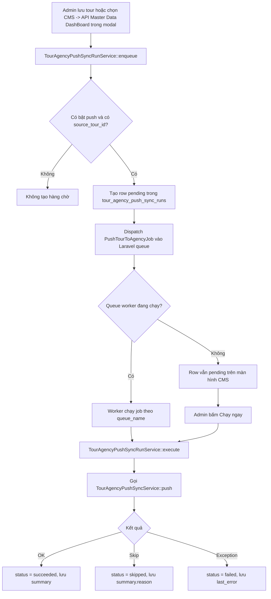

# API Master Data DashBoard Tour Sync Queue Design

Tài liệu này mô tả thiết kế chức năng quản lý hàng chờ đồng bộ tour từ CMS Haidang Travel sang `API Master Data DashBoard`.

Tên hiển thị trong admin là `API Master Data DashBoard`. Một số route, biến môi trường, class và field nội bộ vẫn giữ chữ `agency` để không phá contract đồng bộ đã triển khai.

Tài liệu contract API và payload nằm ở `docs/AGENCY_TOUR_SYNC_API.md`. File này tập trung vào lifecycle, trạng thái, màn hình quản trị và cách vận hành hàng chờ.

## 1. Mục Tiêu

- Admin CMS nhìn thấy các lượt gửi tour sang `API Master Data DashBoard` đang chờ xử lý.
- Admin kiểm tra được trạng thái, lỗi cuối cùng, số lần chạy, tour CMS, tour `API Master Data DashBoard` đích và người tạo hàng chờ.
- Admin có thể chạy ngay từng hàng chờ hoặc toàn bộ hàng chờ hiện có, trừ hàng chờ đang `running`, mà không cần đợi queue worker.
- Admin có thể mở khóa hàng chờ `running` bị kẹt quá lâu để chuyển sang `failed` và chạy lại.
- Admin có thể xóa từng hàng chờ đã kết thúc (`succeeded`, `failed`, `skipped`) hoặc xóa tất cả hàng chờ đã kết thúc khỏi database tracking.
- Cơ chế push cũ vẫn chạy qua Laravel queue khi worker hoạt động.
- Lỗi từ `API Master Data DashBoard` không làm mất thao tác lưu tour trong CMS.

## 2. Phạm Vi

Chức năng này chỉ áp dụng cho hướng:

```text
CMS Haidang Travel -> API Master Data DashBoard
```

Nguồn tạo hàng chờ hiện có:

| Trigger | Khi nào tạo | Ý nghĩa |
| --- | --- | --- |
| `tour_saved` | Admin lưu tour đã có mapping `API Master Data DashBoard` | Gửi lại toàn bộ thông tin tour và ngày khởi hành sang `API Master Data DashBoard`. |
| `manual_picker` | Admin dùng modal `Chọn tour đồng bộ` và chọn chiều mặc định `CMS HaidangTravel -> API Master Data DashBoard` | Gắn tour CMS với tour `API Master Data DashBoard` đích rồi đưa vào hàng chờ gửi ngay. |

Pull từ `API Master Data DashBoard` về CMS không tạo push ngược tức thời để tránh vòng lặp đồng bộ.

## 3. Điều Kiện Tạo Hàng Chờ

Một hàng chờ chỉ được tạo khi thỏa các điều kiện:

- `TOUR_SYNC_PUSH_ENABLED=true`.
- Tour CMS có mapping `API Master Data DashBoard` trong `tour_departure_sync_states.source_tour_id`.
- Service tạo hàng chờ xác định được `source_tour_id` và, nếu có, `tour_code`.

Nếu thiếu mapping `API Master Data DashBoard`, CMS bỏ qua tạo hàng chờ. Trường hợp này thường xảy ra với tour CMS tự tạo nhưng chưa chọn tour `API Master Data DashBoard` đích trong modal đồng bộ.

## 4. Màn Hình Quản Trị

Route:

```text
GET /admin/tours/agency-sync-queue
```

Tên route:

```text
admin.tours.agency-sync-queue
```

Permission:

```text
admin.tours.edit
```

Màn hình nằm trong nhóm quản trị Tour và có submenu `Hàng chờ API Master Data DashBoard`.

Thông tin hiển thị:

| Cột | Nội dung |
| --- | --- |
| Trạng thái | `pending`, `running`, `succeeded`, `failed`, `skipped`, ID hàng chờ và số lần chạy. |
| Tour CMS | Tiêu đề tour, link mở trang sửa tour, CMS tour ID. |
| API Master Data DashBoard | `source_tour_id`, `tour_code`. |
| Nguồn tạo | Trigger, queue name, người tạo nếu có. |
| Thời gian | `queued_at`, `started_at`, `finished_at`. |
| Kết quả | Summary thành công/bỏ qua hoặc `last_error`. |
| Hành động | Nút `Chạy ngay` cho từng hàng chờ; nút `Mở khóa đang chạy kẹt` cho row `running` quá 15 phút; nút `Xóa` chỉ hiển thị với hàng chờ đã kết thúc; nút `Xóa tất cả đã kết thúc` ở đầu trang. |

Filter hiện có:

- tìm theo ID hàng chờ, CMS tour ID, `API Master Data DashBoard` tour ID, tiêu đề tour, mã tour `API Master Data DashBoard`,
- trạng thái,
- nguồn tạo.

Trang tự poll mỗi 10 giây khi đang visible để cập nhật trạng thái mới nhất.

## 5. Data Model

Bảng:

```text
tour_agency_push_sync_runs
```

Các field chính:

| Field | Mô tả |
| --- | --- |
| `tour_id` | Tour CMS cần gửi. Null nếu tour đã bị xóa sau khi tạo hàng chờ. |
| `created_by_user_id` | Admin tạo hàng chờ, nếu xác định được. |
| `tour_title` | Snapshot tiêu đề tour tại thời điểm tạo hàng chờ. |
| `source_tour_id` | Tour ID bên `API Master Data DashBoard`. |
| `tour_code` | Mã tour bên `API Master Data DashBoard`, ví dụ `HD010902026`. |
| `trigger` | Nguồn tạo: `tour_saved` hoặc `manual_picker`. |
| `status` | Trạng thái xử lý. |
| `queue_name` | Queue Laravel sẽ chạy job, mặc định theo `TOUR_SYNC_PUSH_QUEUE`. |
| `attempts` | Số lần hệ thống hoặc admin đã chạy hàng chờ này. |
| `deleted_departures` | Snapshot các ngày khởi hành đã bị xóa ở CMS cần báo sang `API Master Data DashBoard`. |
| `summary` | Kết quả rút gọn sau khi chạy thành công hoặc bị skip. |
| `last_error` | Lỗi cuối cùng nếu gọi `API Master Data DashBoard` thất bại. |
| `queued_at` | Thời điểm đưa vào hàng chờ. |
| `started_at` | Thời điểm bắt đầu xử lý gần nhất. |
| `finished_at` | Thời điểm kết thúc gần nhất. |

Indexes quan trọng:

- `source_tour_id`,
- `tour_code`,
- `trigger`,
- `status`,
- `queue_name`,
- `status + queued_at`,
- `tour_id + status`.

## 6. Trạng Thái

| Status | Ý nghĩa |
| --- | --- |
| `pending` | Đã tạo hàng chờ, chưa chạy hoặc chờ chạy lại. |
| `running` | Đang gọi `API Master Data DashBoard`. |
| `succeeded` | Gửi thành công sang `API Master Data DashBoard`. |
| `failed` | Gọi API lỗi hoặc service phát sinh exception. Xem `last_error`. |
| `skipped` | Không gửi vì điều kiện không còn hợp lệ, ví dụ tắt push, thiếu config, mất tour, thiếu mapping. |

Các lý do `skipped` thường gặp trong `summary.reason`:

| Reason | Nguyên nhân |
| --- | --- |
| `disabled` | `TOUR_SYNC_PUSH_ENABLED=false`. |
| `not_configured` | Chưa cấu hình base URL hoặc credential của `API Master Data DashBoard`. |
| `missing_tour` | Tour CMS không còn tồn tại. |
| `missing_source_mapping` | Tour chưa có mapping `API Master Data DashBoard`. |

## 7. Lifecycle



## 8. Cách Xử Lý

### Chạy nền bằng Laravel queue

Khi tạo hàng chờ, CMS dispatch ngay `PushTourToAgencyJob` vào Laravel queue đã cấu hình trong `TOUR_SYNC_PUSH_QUEUE`.

Event log `tour_sync.master_data_dashboard.job_dispatched` xác nhận job đã được đưa vào queue. Nếu có `queued` nhưng không có `job_dispatched`, cần kiểm tra lỗi phát sinh sau bước tạo row hàng chờ.

Nếu production dùng database queue, cần có worker:

```bash
php artisan queue:work --queue=default
```

Nếu cấu hình queue riêng:

```env
TOUR_SYNC_PUSH_QUEUE=agency-sync
```

thì worker cần chạy đúng queue:

```bash
php artisan queue:work --queue=agency-sync,default
```

### Chạy thủ công trong CMS

Nút `Chạy ngay` từng dòng:

- chạy lại hàng chờ được chọn,
- không chạy nếu trạng thái đang là `running`,
- có thể dùng để retry dòng `failed`, `skipped`, hoặc chạy dòng `pending`.

Nút `Mở khóa đang chạy kẹt`:

- tìm các row `running` có `started_at` trống hoặc đã quá 15 phút,
- chuyển các row này sang `failed`,
- ghi `last_error` là hàng chờ đã được admin mở khóa để retry,
- không gọi `API Master Data DashBoard` ngay trong bước mở khóa,
- sau đó admin có thể bấm `Chạy ngay` từng dòng hoặc `Chạy ngay tất cả hiện có`.

Nút `Xóa` từng dòng:

- chỉ hiển thị và chỉ xử lý với hàng chờ đã kết thúc: `succeeded`, `failed`, `skipped`,
- xóa row khỏi bảng `tour_agency_push_sync_runs`,
- không xóa tour CMS, ngày khởi hành hoặc mapping `tour_departure_sync_states`,
- ghi log `tour_sync.master_data_dashboard.queue_deleted` trước khi xóa để vẫn còn dấu vết audit.

Nút `Xóa tất cả đã kết thúc`:

- chỉ xóa các row có trạng thái `succeeded`, `failed`, hoặc `skipped`,
- không xóa các row `pending` hoặc `running`,
- xử lý theo batch để tránh tải quá nhiều row cùng lúc,
- ghi log `tour_sync.master_data_dashboard.queue_deleted` cho từng row và `tour_sync.master_data_dashboard.queue_bulk_deleted` sau khi hoàn tất.

Lưu ý: xóa row tracking không đồng nghĩa xóa tour hoặc ngày khởi hành đã đồng bộ. Nếu một job Laravel cũ còn nằm trong bảng `jobs` nhưng row tracking đã bị xóa, job có `run_id` sẽ ghi log `tour_sync.master_data_dashboard.run_missing` và dừng, không fallback push âm thầm. Các job rất cũ không có `run_id` vẫn dùng flow legacy và gọi `TourAgencyPushSyncService::push()` trực tiếp.

Nút `Chạy ngay tất cả hiện có`:

- lấy toàn bộ row hiện có trừ row đang `running`,
- xử lý theo thứ tự ID tăng dần,
- gọi `API Master Data DashBoard` trực tiếp trong request hiện tại,
- trả flash message tổng số thành công, bỏ qua, lỗi.

Lưu ý vận hành: nếu số lượng hàng chờ lớn hoặc `API Master Data DashBoard` phản hồi chậm, thao tác chạy tất cả có thể lâu. Khi có nhiều hàng chờ, nên ưu tiên queue worker nền.

## 9. Payload Gửi Sang API Master Data DashBoard

Hàng chờ không tự build payload. Khi execute, service gọi:

```text
TourAgencyPushSyncService::push()
```

Payload gửi sang `API Master Data DashBoard` vẫn theo contract:

```http
POST {TOUR_SYNC_API_BASE_URL}/tour/agency/sync/cms-updates
```

Chi tiết payload nằm trong `docs/AGENCY_TOUR_SYNC_API.md`, bao gồm:

- tour-level fields: `cms_tour_id`, `tour_id`, `tour_code`, `title`, `slug`, `status`, `transport`, `standard_label`, `duration_days`, `duration_nights`, giá đang bán, ngày publish/update; khi CMS là nguồn, `slug` cần được cập nhật sang tour đích trên `API Master Data DashBoard`,
- staff quản lý: `manager_email`, `manager`,
- departures hiện có,
- `deleted_startdates` cho ngày khởi hành đã xóa.

Trước khi gửi request, `TourAgencyPushSyncService` normalize payload để khớp các cột legacy của `API Master Data DashBoard`:

| Nhóm field | CMS source | Payload gửi sang API Master Data DashBoard | Lý do |
| --- | --- | --- | --- |
| Nhận diện payload | `sync_log_id` nội bộ CMS | Gửi top-level `client_sync_log_id`, `payload_schema_version=cms_legacy_agency_v3` và `sync_mode`. | Đối chiếu log hai bên và xác nhận queue worker đang chạy đúng bản payload mới. |
| Chuỗi tour-level | `title`, `slug`, `excerpt`, `departure_location`, `transport`, `standard_label`, manager `name/email/phone` | Trim và giới hạn tối đa 255 ký tự; `excerpt` cũng được gửi dưới alias `seodescription`. | Tránh lỗi SQL do các cột legacy như `tours.seodescription` là `varchar(255)`. |
| Optional string null | `manager.phone`, `excerpt`, `seodescription` và các optional string khác | Không gửi key nếu giá trị là `null` hoặc rỗng. | Tránh lỗi validator legacy `sometimes|string` khi key tồn tại nhưng giá trị là `null`. |
| Phạm vi tour | `scope=domestic/international/group` | Giữ `scope`; gửi thêm `isOutbound` và `tour_type`: `international` -> `1`, `domestic`/`group` -> `0`. | API legacy đọc outbound chủ yếu qua số `isOutbound`/`tour_type`; nếu chỉ gửi `international` dạng text có thể bị hiểu sai là tour trong nước. |
| Trạng thái tour | `published`, `draft`, `archived` | `published` -> `published`, `draft` -> `draft`, `archived` -> `inactive`. | API legacy chỉ nhận các trạng thái active/inactive quen thuộc để map sang `tours.status` số. |
| Chuỗi departure-level | `departure_location`, `transport_label`, `standard_label`, `pricing_note` | Trim và giới hạn tối đa 255 ký tự; `pricing_note` cũng được gửi dưới alias `notice_agency`. | Tránh lỗi cột legacy và giữ tương thích với tên field cũ. |
| Departure thiếu field bắt buộc | `return_date`, `transport_label`, `base_price`, `sale_price` có thể trống ở CMS | `return_date` fallback từ `departure_date + duration_days - 1`; `traffic` fallback từ tour `transport`; `base_price` fallback từ tour `base_price`; `sale_price` fallback từ tour `sale_price` hoặc `base_price`. | Validator API legacy bắt buộc `return_date`, `traffic`, `base_price`; fallback giúp tour vẫn sync được khi dữ liệu ngày khởi hành chưa đủ chi tiết. |
| Ghế mở bán agency | `available_slots` | Gửi đồng thời `seat`, `total_seat`, `save_agency`, `available_seat`, `available_slots`. | API legacy map ghế qua nhiều tên field khác nhau; `save_agency` là field dùng khi agency kiểm tra số chỗ còn giữ. |
| Trạng thái ngày khởi hành | `published`, `scheduled`, `sold_out`, `finished`, `cancelled` | `published`/`scheduled` giữ mở; `sold_out`/`finished` -> `closed`; `cancelled` -> `cancelled`; gửi thêm `status_label`. | API legacy xác định `isEnd` bằng text status/status_label, cần có từ khóa `closed` hoặc `cancelled` để đóng ngày khởi hành. |
| Hiển thị agency | Departure status sau normalize | Departure mở gửi `is_agency=1`; `closed`/`cancelled` gửi `is_agency=0`. | API legacy lọc booking/list agency bằng `start_dates.is_agency = 1`. |

Nếu một departure vẫn thiếu dữ liệu tối thiểu sau fallback (`departure_date`, `return_date`, `traffic`, `base_price`, hoặc `status`), CMS bỏ qua departure đó trong payload và ghi log `tour_sync.master_data_dashboard.departure_skipped`. Các trường đã normalize vẫn được ghi trong log `tour_sync.master_data_dashboard.payload_prepared.payload`, nên khi production lỗi có thể đối chiếu trực tiếp payload log với bảng mapping trên.

`API Master Data DashBoard` phải xử lý idempotent vì cùng một hàng chờ có thể được retry.

## 10. Cập Nhật Mapping Sau Khi API Master Data DashBoard Trả Kết Quả

Sau khi `API Master Data DashBoard` trả response thành công, CMS đọc mapping startdate từ các path hỗ trợ:

- `data.startdates`,
- `data.departures`,
- `data.startdate_mappings`,
- `startdates`,
- `departures`,
- `startdate_mappings`.

Mỗi row mapping nên có:

```json
{
  "cms_departure_id": 789,
  "startdate_id": 30001
}
```

CMS dùng mapping này để cập nhật `tour_departure_sync_states`, giúp lần push sau biết departure CMS nào tương ứng với `startdate_id` nào bên `API Master Data DashBoard`.

Summary lưu trong `tour_agency_push_sync_runs.summary` và log `processing_finished` gồm:

| Field | Ý nghĩa |
| --- | --- |
| `skipped` | `false` nếu CMS đã gọi API và xử lý response; `true` nếu bị bỏ qua. |
| `tour_id` | Tour ID trong CMS. |
| `source_tour_id` | Tour ID bên `API Master Data DashBoard` đang được push. |
| `departures` | Số ngày khởi hành CMS đã gửi trong payload. |
| `deleted_departures` | Số ngày khởi hành đã xóa CMS báo sang API. |
| `response_status` | Giá trị `status` API trả về, ví dụ `success`. |
| `response_tour_id` | Tour ID API trả về trong response, nếu có. |
| `response_tour_code` | Mã tour API trả về trong response, nếu có. |
| `returned_mappings_count` | Số mapping startdate API trả về. |
| `returned_startdate_ids` | Danh sách `startdate_id` API trả về để CMS lưu mapping. |

## 11. System Logs

Mỗi lần CMS push tour sang `API Master Data DashBoard`, hệ thống ghi log có cấu trúc vào Laravel system log. Các log này không ghi bearer token hoặc credential.

Các event chính:

| Event log | Level | Khi nào ghi |
| --- | --- | --- |
| `tour_sync.master_data_dashboard.queued` | `info` | Ngay khi CMS tạo row `pending` trong hàng chờ push. |
| `tour_sync.master_data_dashboard.job_dispatched` | `info` | Ngay khi CMS đưa `PushTourToAgencyJob` vào Laravel queue. |
| `tour_sync.master_data_dashboard.processing_started` | `info` | Khi queue worker hoặc nút `Chạy ngay` bắt đầu xử lý một row hàng chờ. |
| `tour_sync.master_data_dashboard.payload_prepared` | `info` | Sau khi CMS build xong payload tour/departures. |
| `tour_sync.master_data_dashboard.request_sending` | `info` | Ngay trước khi CMS gửi request sang endpoint push. |
| `tour_sync.master_data_dashboard.response_received` | `info` | Khi nhận response thành công từ `API Master Data DashBoard`. |
| `tour_sync.master_data_dashboard.response_failed` | `error` | Khi request lỗi hoặc API trả lỗi khiến client throw exception. |
| `tour_sync.master_data_dashboard.departure_skipped` | `warning` | Khi một ngày khởi hành CMS thiếu dữ liệu tối thiểu sau fallback nên không được gửi trong payload. |
| `tour_sync.master_data_dashboard.processing_finished` | `info` | Khi một row hàng chờ kết thúc với trạng thái `succeeded` hoặc `skipped`. |
| `tour_sync.master_data_dashboard.processing_failed` | `error` | Khi một row hàng chờ kết thúc lỗi và được lưu `failed`. |
| `tour_sync.master_data_dashboard.queue_deleted` | `info` | Khi admin xóa một row hàng chờ đã kết thúc khỏi database. |
| `tour_sync.master_data_dashboard.queue_bulk_deleted` | `info` | Khi admin xóa tất cả row hàng chờ đã kết thúc khỏi database tracking. |
| `tour_sync.master_data_dashboard.queue_unlocked` | `warning` | Khi admin mở khóa một row `running` quá 15 phút để retry. |
| `tour_sync.master_data_dashboard.queue_bulk_unlocked` | `info` | Sau khi thao tác mở khóa hàng chờ kẹt hoàn tất. |
| `tour_sync.master_data_dashboard.run_missing` | `notice` | Khi một job nền có `run_id` nhưng row tracking đã bị xóa; job sẽ dừng để tránh push không còn tracking. |
| `tour_sync.master_data_dashboard.skipped` | `notice` | Khi lượt push bị bỏ qua vì tắt config, thiếu config, thiếu tour hoặc thiếu mapping. |

Các field log quan trọng:

| Field | Ý nghĩa |
| --- | --- |
| `sync_log_id` | ID để nối các dòng log của cùng một lần đồng bộ. |
| `run_id` | ID row trong `tour_agency_push_sync_runs`, có ở event `queued`. |
| `cms_tour_id` | ID tour CMS. |
| `source_tour_id` | ID tour bên `API Master Data DashBoard`. |
| `tour_code` | Mã tour bên `API Master Data DashBoard`. |
| `trigger` | Nguồn tạo hàng chờ, ví dụ `tour_saved` hoặc `manual_picker`. |
| `sync_mode` | Chế độ push; màn hình hiện tại chủ yếu dùng `full` cho các lượt gửi CMS sang `API Master Data DashBoard`. |
| `push_path` | Endpoint path CMS gọi sang. |
| `queue_name` | Queue Laravel xử lý job push. |
| `transport` | Phương tiện tour-level đang gửi. |
| `duration_days` | Số ngày tour-level đang gửi. |
| `duration_nights` | Số đêm tour-level đang gửi. |
| `departures_count` | Số ngày khởi hành trong payload. |
| `deleted_startdates_count` | Số ngày khởi hành CMS báo đã xóa/hủy. |
| `departure_transport_labels` | Danh sách phương tiện theo ngày khởi hành. |
| `payload` | Chỉ có ở event `payload_prepared`, dùng để audit gói tin đã chuẩn bị. |
| `response` | Chỉ có ở event `response_received`, dùng để audit phản hồi từ API. |
| `error_message` | Chỉ có ở event `response_failed`, là lỗi rút gọn để tra cứu nhanh. |

Nếu server chỉ có event `queued` mà không có `processing_started`, hàng chờ chưa được xử lý. Khi đó cần kiểm tra queue worker đang chạy đúng queue name, hoặc vào `/admin/tours/agency-sync-queue` bấm `Chạy ngay` cho row tương ứng.

Vị trí file log phụ thuộc `LOG_CHANNEL`:

| `LOG_CHANNEL` | File thường dùng |
| --- | --- |
| `daily` | `storage/logs/laravel-YYYY-MM-DD.log`, ví dụ `storage/logs/laravel-2026-05-25.log`. |
| `single` | `storage/logs/laravel.log`. |

Ví dụ grep log trên Linux/server:

```bash
grep "tour_sync.master_data_dashboard" storage/logs/laravel-*.log
grep "sync_log_id" storage/logs/laravel-*.log
grep "HD010902026" storage/logs/laravel-*.log
```

Ví dụ kiểm tra trên Windows/PowerShell:

```powershell
Select-String -Path storage\logs\*.log -Pattern "tour_sync.master_data_dashboard"
Select-String -Path storage\logs\*.log -Pattern "HD010902026"
```

## 12. Ví Dụ Vận Hành

Thông báo:

```text
Đã đưa tour "Tour Cần Thơ Team Building 2N1Đ Cho Doanh Nghiệp | Du Thuyền Ninh Kiều – KDL Ông Đề" vào hàng đợi gửi sang API Master Data DashBoard tour ID 1090 - mã HD010902026.
```

Ý nghĩa:

- CMS đã tạo row `pending` trong `tour_agency_push_sync_runs`.
- Nếu queue worker đang chạy đúng queue, row sẽ tự chuyển sang `running`, sau đó `succeeded`, `failed`, hoặc `skipped`.
- Nếu không có worker, row sẽ giữ `pending` cho tới khi admin bấm `Chạy ngay` hoặc `Chạy ngay tất cả hiện có`.
- Admin có thể tìm theo `1090`, `HD010902026`, CMS tour ID hoặc tiêu đề tour trên màn hình `/admin/tours/agency-sync-queue`.
- Có thể tìm log theo `tour_sync.master_data_dashboard` hoặc mã tour `HD010902026`.

## 13. Cấu Hình Liên Quan

```env
TOUR_SYNC_API_BASE_URL=https://agency.example.test/api
TOUR_SYNC_API_USERNAME=
TOUR_SYNC_API_PASSWORD=
TOUR_SYNC_API_TOKEN=
TOUR_SYNC_LOGIN_PATH=/DashboardLogin
TOUR_SYNC_PUSH_ENABLED=true
TOUR_SYNC_PUSH_PATH=/tour/agency/sync/cms-updates
TOUR_SYNC_PUSH_QUEUE=default
QUEUE_CONNECTION=database
```

Ghi chú:

- `TOUR_SYNC_API_BASE_URL` là base URL `API Master Data DashBoard` mà CMS gọi sang.
- `TOUR_SYNC_PUSH_ENABLED=false` sẽ làm service không tạo hàng chờ mới và các hàng chờ chạy lại sẽ bị `skipped`.
- `TOUR_SYNC_PUSH_QUEUE` quyết định queue name lưu trong hàng chờ và queue của `PushTourToAgencyJob`.
- `TOUR_SYNC_PUSH_PATH` không được để rỗng. Nếu `.env` bị set rỗng, CMS dùng mặc định `/tour/agency/sync/cms-updates`.
- Push response từ `API Master Data DashBoard` phải có `status=success` hoặc `status=ok`. Nếu API trả `[]`, rỗng hoặc thiếu status thành công, hàng chờ sẽ chuyển `failed` để tránh báo thành công giả.

## 14. File Implementation Chính

| File | Vai trò |
| --- | --- |
| `database/migrations/2026_05_24_000000_create_tour_agency_push_sync_runs_table.php` | Tạo bảng tracking hàng chờ. |
| `Src/Domains/Cms/Models/TourAgencyPushSyncRun.php` | Model trạng thái hàng chờ. |
| `app/Services/Travel/TourAgencyPushSyncRunService.php` | Tạo và execute hàng chờ. |
| `app/Jobs/Travel/PushTourToAgencyJob.php` | Job nền xử lý push sang `API Master Data DashBoard`. |
| `app/Services/Travel/TourAgencyPushSyncService.php` | Build payload, gọi `API Master Data DashBoard`, cập nhật mapping. |
| `app/Livewire/Admin/Cms/TourAgencySyncQueueManager.php` | Manager màn hình hàng chờ. |
| `resources/views/livewire/admin/cms/tours/agency-sync-queue.blade.php` | UI danh sách/filter/action hàng chờ. |
| `routes/admin.php` | Route `/admin/tours/agency-sync-queue`. |
| `app/Support/Admin/AdminNavigationRegistry.php` | Submenu `Hàng chờ API Master Data DashBoard`. |
| `app/Livewire/Admin/Cms/ToursManager.php` | Tạo hàng chờ khi lưu tour hoặc chọn chiều CMS -> `API Master Data DashBoard`. |

## 15. Test Coverage

Các test chính:

| Test | Mục tiêu |
| --- | --- |
| `tests/Feature/Admin/TourAgencySyncQueueManagerTest.php` | Chạy ngay toàn bộ hàng chờ hiện có trừ `running`, mở khóa `running` kẹt, xóa hàng chờ đã kết thúc và xác nhận payload gọi `API Master Data DashBoard`. |
| `tests/Feature/Admin/ToursManagerTest.php` | Xác nhận lưu tour và modal CMS -> `API Master Data DashBoard` tạo row pending, dispatch job có `runId`. |
| `tests/Feature/AgencyTourPushSyncTest.php` | Xác nhận payload push, normalize field legacy, log hệ thống, mapping response và deleted startdates. |
| `tests/Feature/AgencyTourExportApiTest.php` | Xác nhận API export cho `API Master Data DashBoard` pull dữ liệu. |

Validation nên chạy sau khi sửa chức năng:

```bash
php artisan route:list --path=admin/tours/agency-sync-queue
php artisan test tests/Feature/Admin/TourAgencySyncQueueManagerTest.php
php artisan test tests/Feature/Admin/ToursManagerTest.php --filter=agency
php artisan test tests/Feature/AgencyTourPushSyncTest.php
```

## 16. Rủi Ro Và Giới Hạn

- Hàng chờ tạo trước khi bảng tracking này tồn tại không tự xuất hiện trong màn hình mới. Có thể chạy queue worker cũ hoặc thao tác lại lưu tour/chọn đồng bộ để tạo row tracking mới.
- Nút `Chạy ngay tất cả hiện có` chạy trong request web hiện tại, nên không phù hợp để xử lý số lượng rất lớn.
- Chưa có khóa chống hai admin cùng bấm chạy một row gần như đồng thời. Trạng thái `running` giảm rủi ro ở UI, nhưng nếu cần đảm bảo tuyệt đối thì nên bổ sung DB lock.
- Nút mở khóa chỉ xử lý row `running` quá 15 phút. Nếu API đích thật sự đang xử lý rất lâu, cần kiểm tra log `request_sending`/`response_received` trước khi retry để tránh gửi trùng ngoài ý muốn.
- `failed` không tự retry theo scheduler riêng. Hiện admin retry thủ công bằng `Chạy ngay`, hoặc vận hành queue worker nếu job vẫn còn trong queue.
- `API Master Data DashBoard` phải idempotent, vì cùng payload có thể được gửi lại sau retry.
- Event `payload_prepared` ghi payload để audit nên log có thể dài với tour có nhiều ngày khởi hành.

## 17. Checklist Triển Khai Production

- Chạy migration để có bảng `tour_agency_push_sync_runs`.
- Kiểm tra `TOUR_SYNC_API_BASE_URL`, credential login/token và `TOUR_SYNC_PUSH_PATH`.
- Bật `TOUR_SYNC_PUSH_ENABLED=true`.
- Chạy queue worker đúng queue nếu muốn tự xử lý nền.
- Cấp permission `admin.tours.edit` cho nhóm nhân sự cần xem và chạy hàng chờ.
- Mở `/admin/tours/agency-sync-queue` để kiểm tra số lượng `pending`, `failed`, `skipped`.
- Sau khi `API Master Data DashBoard` fix API hoặc đổi contract, chạy lại một hàng chờ test trước khi chạy toàn bộ.
